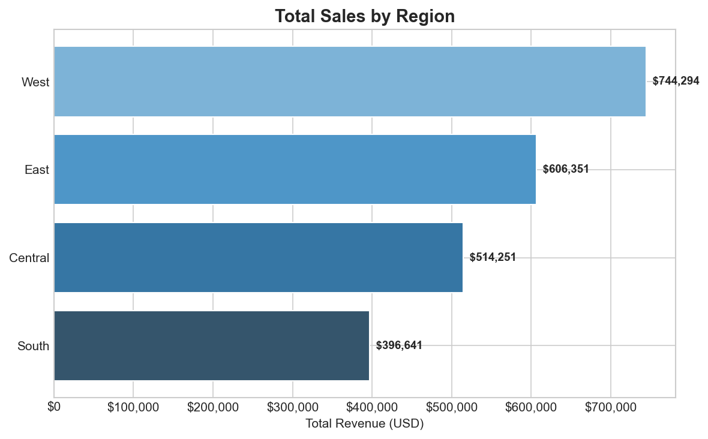

# 🏪 Superstore Sales Data

This project transforms raw retail transaction data from the Superstore Sales Dataset (https://www.kaggle.com/datasets/rohitsahoo/sales-forecasting/data) into a structured sales data warehouse for analytics and reporting. The goal is to turn fragmented transactional records into a reliable source of truth that supports business analysis across products, customers, regions, and time.

Using PostgreSQL, Python, and SQLAlchemy, the project builds an end-to-end ETL pipeline and models the data with a star schema consisting of fact and dimension tables. This structure makes it easier to analyze revenue trends, customer behavior, product performance, and regional sales contribution in a consistent and reusable way.

On top of the warehouse, the project extends into predictive analytics by preparing time-based sales aggregates and building a forecasting workflow to estimate future sales. This allows the repository to support both business intelligence use cases and forward-looking planning.

---

## 🎯 Business Objectives and Analytical Goals

This project is designed to support both historical sales analysis and short-term forecasting. The main objectives are:

- Identify the product categories and sub-categories that contribute the most to overall sales performance.
- Measure monthly sales patterns, growth trends, and cumulative revenue over time.
- Segment customers using RFM analysis to distinguish high-value and low-engagement customer groups.
- Compare regional sales performance to identify strong and weak markets.
- Build a time series forecasting workflow to predict future sales based on historical transaction patterns.
- Create a structured warehouse model that supports repeatable reporting and predictive analysis.

---

## 🗃️ Schema Design — Star Schema

| Table | Type | Description |
|---|---|---|
| `FactSales` | Fact | Core sales transactions |
| `DimProduct` | Dimension | Product catalog and categories |
| `DimCustomer` | Dimension | Customer profiles and regions |
| `DimDate` | Dimension | Calendar dimension |

---

## 🛠️ Tech Stack

| Tool | Purpose |
|---|---|
| PostgreSQL 18 + pgAdmin 4 | Database engine and query development |
| Python (pandas, SQLAlchemy) | ETL pipeline and data export |
| matplotlib + seaborn | Chart generation |
| SQL (CTEs, Window Functions) | Advanced analytics |

---

## 📁 Project Structure

```
Sales-Data-Warehouse/
├── data/
├── etl/
├── sql/
├── analysis/
├── forecasting/
│   ├── prepare_ts.py
│   ├── train_forecast.py
│   └── forecast_output.csv
├── output/
└── README.md

```

---

## 📈 Sample Visualizations

### Revenue by Category


### Monthly Revenue Trend


### Month-over-Month Growth


### Cumulative Revenue


### RFM Customer Segments


### Total Sales by Region


