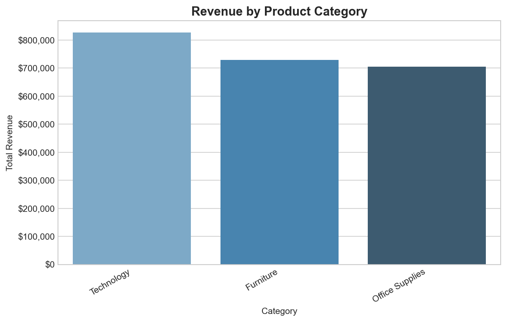
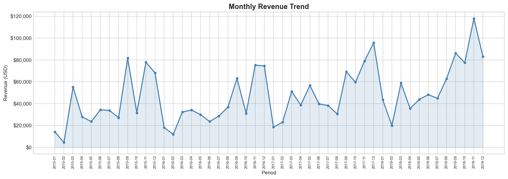
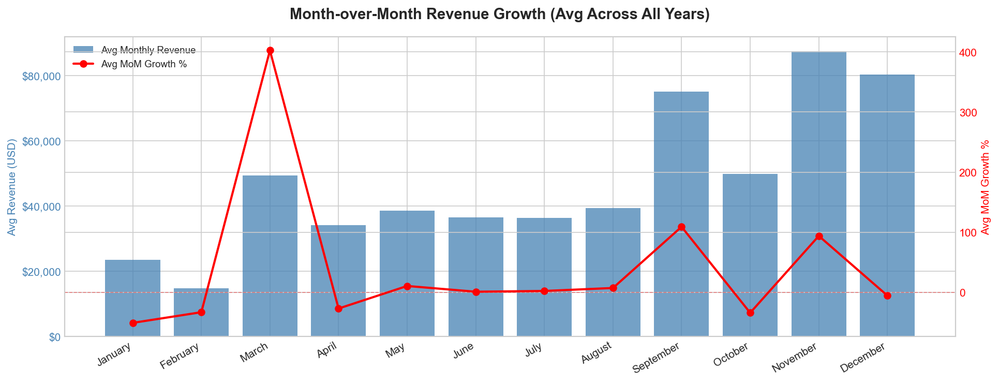
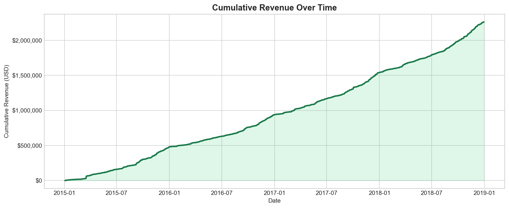
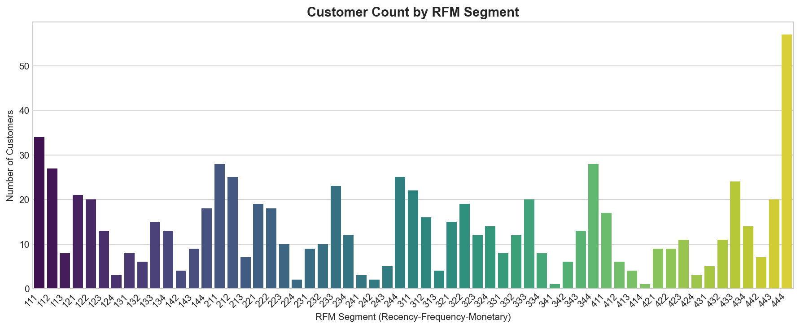

# 🏪 Sales Data Warehouse

> End-to-end data warehouse built with **PostgreSQL 18**, **Python**, and **SQLAlchemy**.  
> Covers ETL pipeline design, star schema modeling, advanced SQL analytics, and business reporting.

---

## 📊 Key Business Questions Answered
- Which product categories drive the most revenue?
- What is the month-over-month revenue growth trend?
- Who are the top customers by RFM segmentation?
- How does cumulative revenue grow over time?
- Which regions contribute most to total sales?

---

## 🗃️ Schema Design — Star Schema

| Table | Type | Description |
|---|---|---|
| `FactSales` | Fact | Core sales transactions |
| `DimProduct` | Dimension | Product catalog and categories |
| `DimCustomer` | Dimension | Customer profiles and regions |
| `DimDate` | Dimension | Calendar dimension |

---

## 🛠️ Tech Stack

| Tool | Purpose |
|---|---|
| PostgreSQL 18 + pgAdmin 4 | Database engine and query development |
| Python (pandas, SQLAlchemy) | ETL pipeline and data export |
| matplotlib + seaborn | Chart generation |
| SQL (CTEs, Window Functions) | Advanced analytics |

---

## 📁 Project Structure

```
Sales-Data-Warehouse/
├── data/               # Raw source data
├── etl/
│   └── etl.py          # ETL pipeline
├── sql/
│   ├── queries.sql     # All reporting queries
│   └── views.sql       # Database views
├── analysis/
│   ├── visualize.py    # Chart generation
│   └── charts/         # Output charts
├── output/             # Exported CSV reports
└── README.md
```

---

## 📈 Sample Visualizations

### Revenue by Category


### Monthly Revenue Trend


### Month-over-Month Growth


### Cumulative Revenue


### RFM Customer Segments


---

## 🔑 SQL Skills Demonstrated
- **Window Functions** — `LAG()`, `SUM() OVER()`, `NTILE()`
- **CTEs** — Multi-step RFM segmentation
- **JOINs** — Fact-to-dimension joins across star schema
- **Views** — Reusable reporting layer
- **Aggregations** — Revenue, profit, order count by dimension
